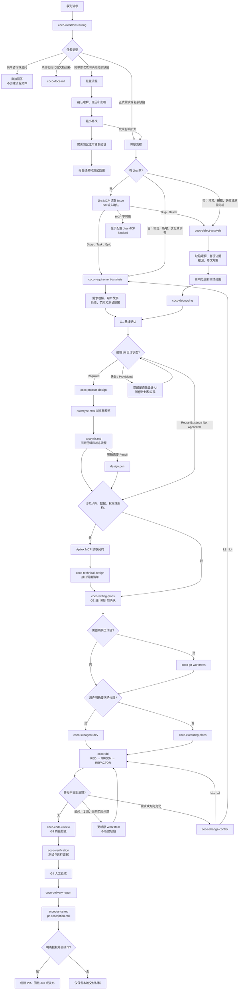

# Coco Skills

一套供个人使用的 Codex 软件开发技能，参考 CMMI、规格驱动开发、证据驱动验证和 AI 原生 SDLC 方法设计。

这些技能统一使用 `coco-` 前缀，不依赖 `aile-*` 或 `superpowers`，覆盖 Jira 接入、需求、缺陷、HTML 原型、可选 Pencil 设计、计划、开发、测试、审查、验证、PR 和交付。

## 项目特点

- 需求和缺陷分流：缺陷先分析复现证据、根因、改动范围和测试影响。
- 分级变更控制：开发中的人工测试反馈按 L0-L4 处理，小细节只更新最小必要文件。
- 证据驱动验证：Build 成功不能替代 API、数据库、浏览器和真实运行时验证。
- 项目可配置：不硬编码固定工期或覆盖率，优先服从项目规则。
- 团队协作门禁：使用 G0-G4 人工检查点连接 Jira、HTML 原型、可选 Pencil、计划、实现、PR 和验收。
- 分级流程：简单调整和已明确的局部缺陷走轻量流程，复杂或高风险工作项走完整流程。
- 上下文连续性：同一需求/缺陷下的追问、复测和直接相关测试反馈沿用原工作项，不自动新建缺陷。

## 统一输出规范

所有 `coco-*` 技能执行时只输出核心内容：删除客套话、长篇铺垫、重复信息和无关说明；代码、文档和注释保持最小必要范围；报告优先给出结论、变更、验证结果和阻塞项。

## MCP 集成规则

- 遇到 Jira 单号、Jira 链接或明确来自 Jira 的需求/缺陷时，优先使用 Jira MCP 读取 Issue，并按需读取评论、附件和关联事项。
- 涉及 Server、后端 API、接口参数、请求响应、鉴权或错误码时，优先使用 Apifox MCP 刷新并读取最新 OpenAPI 契约。
- Jira、Apifox、代码和实际运行结果不一致时，必须明确列出差异，不能静默选择其中一份作为正确答案。
- Jira 评论、状态、字段、附件，以及 Apifox 接口的写操作都需要用户明确授权；默认仅执行读取和分析。
- 有 Jira 单时先用 Jira MCP 读取 Issue Type；MCP 未配置或失败时提示配置并阻塞，不能猜测故事/缺陷类型。
- 无 Jira 时按用户语义路由：“实现/新增/优化/调整”归需求；“报错/异常/失败/原因分析/排查/定位”归缺陷诊断；概念或使用问题直接回答。
- Jira 分析首先给出需求/缺陷理解；缺陷必须继续给出根因、修改方案、影响范围和测试范围，确认后才能执行。
- 前端调用接口时必须用 Apifox MCP 读取契约；生成的方法、路径和调用文件写入接口清单，页面逻辑判断和状态流程写入设计文件并在 G2 确认。

## 技能目录

| Skill | 用途 |
| --- | --- |
| `coco-workflow-routing` | 判断需求、缺陷、技术债和开发中变更的处理路径 |
| `coco-docs-init` | 初始化或回补项目工程文档 |
| `coco-requirement-analysis` | 需求、范围、用户故事、验收标准和风险分析 |
| `coco-defect-analysis` | 缺陷复现、根因、影响范围和回归测试分析 |
| `coco-product-design` | UI、交互、页面状态和可访问性设计 |
| `coco-technical-design` | 架构、API、数据库、权限、安全和可观测性设计 |
| `coco-writing-plans` | 将分析和设计拆成可执行计划 |
| `coco-change-control` | 管理人工测试反馈和开发方向调整 |
| `coco-git-worktrees` | 创建和验证隔离 Git 工作区 |
| `coco-executing-plans` | 按计划和垂直切片执行开发 |
| `coco-tdd` | 执行 RED -> GREEN -> REFACTOR |
| `coco-subagent-dev` | 用户明确要求时编排并行子代理开发 |
| `coco-debugging` | 证据驱动的复现、假设验证和根因定位 |
| `coco-code-review` | 功能、架构、安全、性能和测试审查 |
| `coco-verification` | 收集测试和 Runtime 验证凭据 |
| `coco-delivery-report` | 生成验收、交付摘要和残余风险记录 |

## 安装

安装前可以先查看仓库内可用的 skill：

```powershell
npx skills add Coco131452/coco-skills --list
```

### 安装全部 skill 到 Codex（推荐）

一键安装（会先检测 Codex）：

```powershell
node scripts/install-codex-skills.js
```

也可以直接执行安装命令：

```powershell
npx skills add Coco131452/coco-skills --skill '*' --agent codex -g -y --copy
```

`--skill '*'` 表示安装仓库中的全部 skill，`--agent codex` 将目标限定为 Codex，`-g` 表示安装到用户级，`-y` 跳过确认，`--copy` 将文件复制到全局目录。

不要将 `--all -g` 作为全局安装命令：它会尝试安装到所有已检测到的代理，Eve 和 PromptScript 不支持全局 skill，因此会出现对应的失败提示。

### 安装指定 skill

```powershell
npx skills add Coco131452/coco-skills `
  --skill coco-workflow-routing coco-requirement-analysis `
  --agent codex -g -y --copy
```

也可以使用完整 GitHub 地址：

```powershell
npx skills add https://github.com/Coco131452/coco-skills.git `
  --skill coco-defect-analysis `
  --agent codex -g -y --copy
```

### 查看已安装 skill

```powershell
npx skills list -g
```

如果不使用 `-g`，Skills CLI 默认根据当前位置安装为项目级 skill。

## 更新

Skills CLI 当前没有单独的检查命令；使用 `update` 会检查并更新已安装 skill。

更新全部全局 skill：

```powershell
npx skills update -g -y
```

更新完成后重新打开 Codex 会话，以加载最新技能描述。

### 手动安装备用方式

仅当 Skills CLI 无法使用时，才手动将完整的 `coco-*` 目录复制到：

```text
macOS / Linux: ~/.agents/skills/
Windows: %USERPROFILE%\.agents\skills\
```

如果只为 Codex 手动维护技能，也可以使用 Codex 用户技能目录 `%USERPROFILE%\.codex\skills\`。不要只复制 `SKILL.md`，否则可能遗漏 `agents/`、`references/` 或 `scripts/`。

## 使用

Codex 可以根据描述自动选择技能，也可以显式调用：

```text
使用 $coco-workflow-routing 判断这个工作项应该走需求还是缺陷流程。
```

需求分析：

```text
使用 $coco-requirement-analysis 分析这个新功能。
```

缺陷分析：

```text
使用 $coco-defect-analysis 分析问题根因、影响范围和回归测试范围。
```

开发执行：

```text
使用 $coco-writing-plans 生成开发计划。
使用 $coco-executing-plans 执行已确认计划。
```

### 流程图



工作项文档遵循 Aile 兼容路径：

```text
docs/plans/{Work-Item-Key}/
```

需求核心文件为 `analysis.md`、`plan.md`、`verification.md`；缺陷核心文件为 `defect-analysis.md`、`plan.md`、`verification.md`。前端需求必须记录 UI 设计状态；`Required` 时创建 `prototype.html` 并在 `analysis.md` 记录页面逻辑，状态未确认时暂停计划和实现并提醒用户。前端有 API 调用时按需创建 `technical-design.md` 并维护接口调用清单；`design.pen` 仅在明确要求 Pencil 时创建；`change-log.md`、`acceptance.md` 和 `pr-description.md` 按需创建，进入交付时应生成 `pr-description.md`。

团队检查点：G0 Jira 输入确认，G1 需求/缺陷基线确认，G2 HTML 原型预览/可选 Pencil/技术设计/计划确认，G3 实现与代码审查，G4 验收与 PR 交付。Jira 状态、评论、PR 创建和部署均需用户明确授权。

同一工作项的后续提问、复测和相关失败更新原目录/文档；仅独立问题或明确要求单独跟踪时才创建关联缺陷。

项目级文档遵循团队固定目录：`docs/README.md`、`docs/specs/*`、`docs/guides/*`、`docs/modules/*`、`docs/database/*`、`docs/api/api-spec.md` 和 `docs/plans/{Work-Item-Key}/`。每次交付只更新实际受影响的文件，并在 `verification.md` 中记录同步结果或不适用原因。

## 安全与维护

- 不要提交 `.env`、API Key、密码、证书或个人 Token。
- 修改 skill 后先运行相关脚本测试和结构校验。
- 重大流程调整应同步更新相关 `SKILL.md`、参考文件和 README。
- 提交、推送、创建 PR、部署和外部工单同步都需要明确授权。

## License

当前仓库尚未指定开源许可证。需要公开授权他人使用或修改时，请增加合适的 `LICENSE` 文件。
